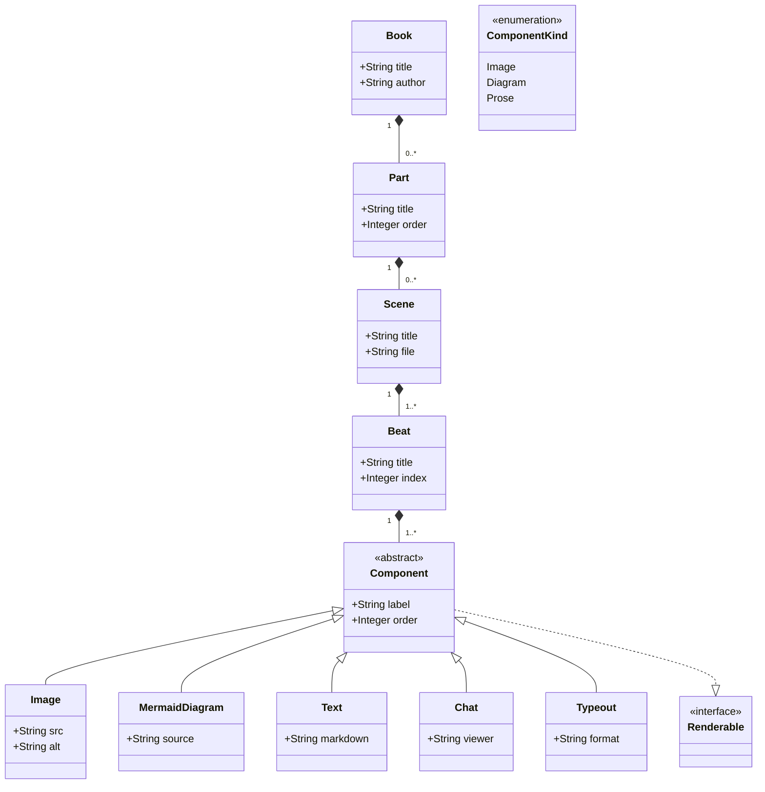
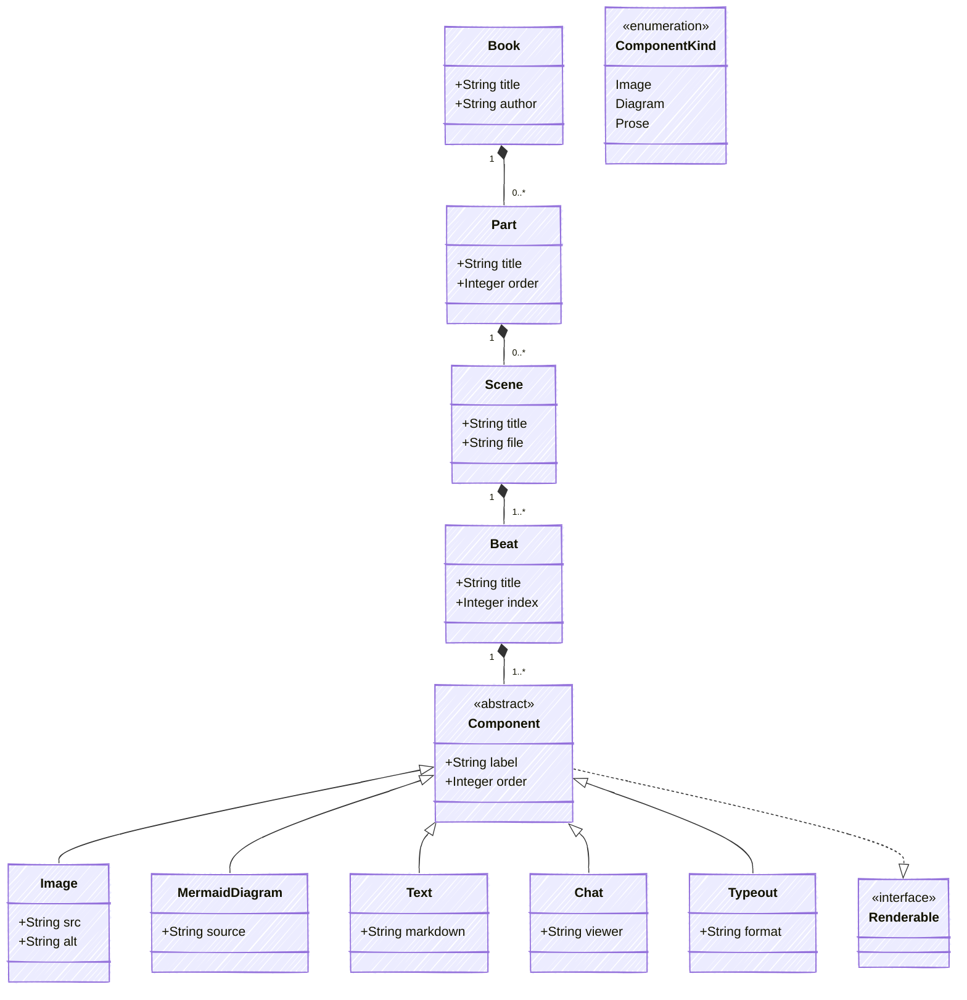

# Structure note

The same structure introduced in the opening beat, in both presentations.

```mermaid
classDiagram
  direction TB
  accTitle: Story Teller structure
  accDescr: A book contains parts, scenes and beats. Each beat contains authored components, including images, diagrams, prose, chats and typeout output.
  class Book {
    +String title
    +String author
  }
  class Part {
    +String title
    +Integer order
  }
  class Scene {
    +String title
    +String file
  }
  class Beat {
    +String title
    +Integer index
  }
  class Component {
    <<abstract>>
    +String label
    +Integer order
  }
  class Image {
    +String src
    +String alt
  }
  class MermaidDiagram {
    +String source
  }
  class Text {
    +String markdown
  }
  class Chat {
    +String viewer
  }
  class Typeout {
    +String format
  }
  class Renderable <<interface>>
  class ComponentKind
  <<enumeration>> ComponentKind
  ComponentKind : Image
  ComponentKind : Diagram
  ComponentKind : Prose
  Book "1" *-- "0..*" Part
  Part "1" *-- "0..*" Scene
  Scene "1" *-- "1..*" Beat
  Beat "1" *-- "1..*" Component
  Component <|-- Image
  Component <|-- MermaidDiagram
  Component <|-- Text
  Component <|-- Chat
  Component <|-- Typeout
  Component ..|> Renderable
```

```mermaid
---
config:
  look: handDrawn
  handDrawnSeed: 42
---
classDiagram
  direction TB
  accTitle: Story Teller structure
  accDescr: A book contains parts, scenes and beats. Each beat contains authored components, including images, diagrams, prose, chats and typeout output.
  class Book {
    +String title
    +String author
  }
  class Part {
    +String title
    +Integer order
  }
  class Scene {
    +String title
    +String file
  }
  class Beat {
    +String title
    +Integer index
  }
  class Component {
    <<abstract>>
    +String label
    +Integer order
  }
  class Image {
    +String src
    +String alt
  }
  class MermaidDiagram {
    +String source
  }
  class Text {
    +String markdown
  }
  class Chat {
    +String viewer
  }
  class Typeout {
    +String format
  }
  class Renderable <<interface>>
  class ComponentKind
  <<enumeration>> ComponentKind
  ComponentKind : Image
  ComponentKind : Diagram
  ComponentKind : Prose
  Book "1" *-- "0..*" Part
  Part "1" *-- "0..*" Scene
  Scene "1" *-- "1..*" Beat
  Beat "1" *-- "1..*" Component
  Component <|-- Image
  Component <|-- MermaidDiagram
  Component <|-- Text
  Component <|-- Chat
  Component <|-- Typeout
  Component ..|> Renderable
```
