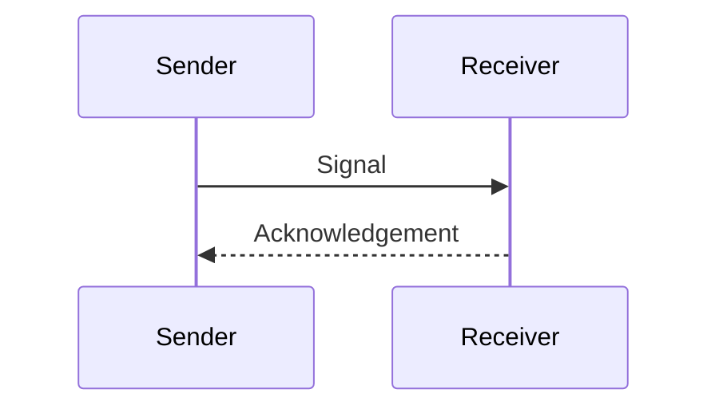

# End of example

```mermaid
sequenceDiagram
  accTitle: Acknowledgement
  accDescr: Sender sends a signal and receiver acknowledges it.
  Sender->>Receiver: Signal
  Receiver-->>Sender: Acknowledgement
```

*Caption: An explicitly authored diagram.*

```mermaid
flowchart LR
 broken [
```
