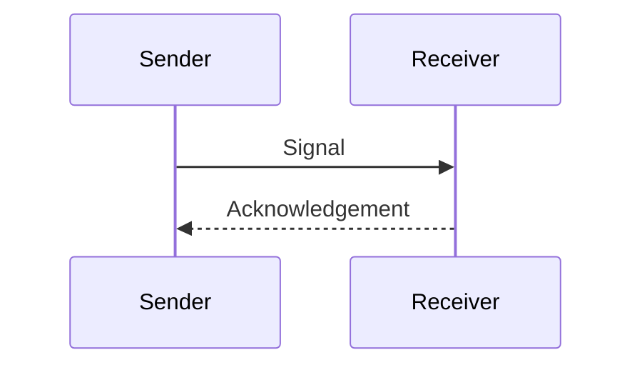

# Signal note

This neutral note describes only the signal introduced at first access.

```mermaid
flowchart LR
  accTitle: Signal route
  accDescr: A signal moves from sender to relay to receiver.
  A[Sender] --> B[Relay] --> C[Receiver]
```

```mermaid
sequenceDiagram
  accTitle: Acknowledgement
  accDescr: Sender sends a signal and receiver acknowledges it.
  Sender->>Receiver: Signal
  Receiver-->>Sender: Acknowledgement
```
