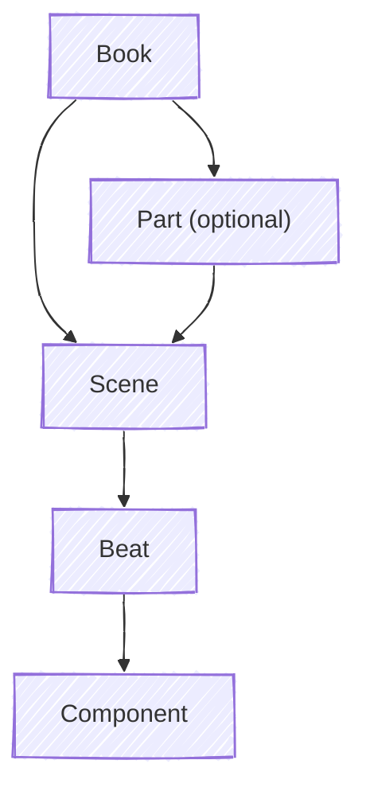
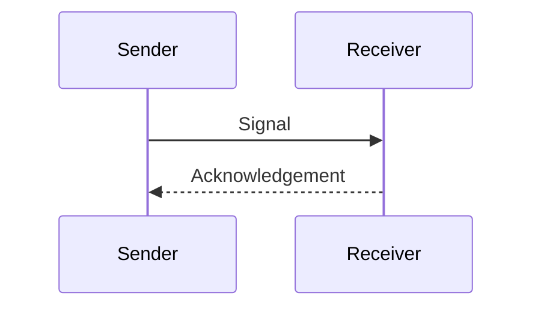
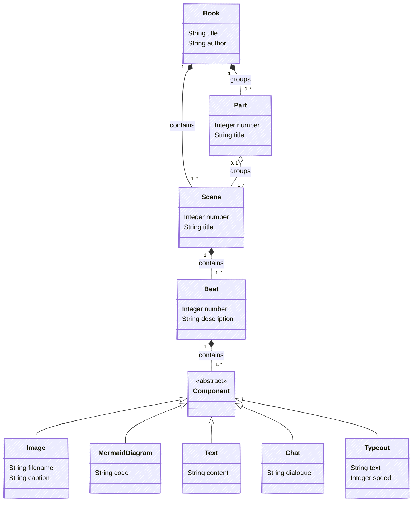

# Hand-drawn examples

```mermaid
---
config:
  look: handDrawn
  handDrawnSeed: 41
---
flowchart TD
  accTitle: Story Teller reading structure
  accDescr: A book contains scenes, optionally grouped into parts. Scenes contain beats, and beats contain components.
  Book --> Part["Part (optional)"]
  Book --> Scene
  Part --> Scene
  Scene --> Beat
  Beat --> Component
```

*Caption: Hand-drawn flowchart.*

```mermaid
---
config:
  look: handDrawn
  handDrawnSeed: 41
---
sequenceDiagram
  accTitle: Signal exchange
  accDescr: Sender sends a signal and Receiver replies.
  Sender->>Receiver: Signal
  Receiver-->>Sender: Acknowledgement
```

*Caption: Hand-drawn sequence.*

```mermaid
---
config:
  look: handDrawn
  handDrawnSeed: 41
---
classDiagram
    direction TB
    accTitle: A conceptual Story Teller book
    accDescr: Books contain scenes, optionally grouped into parts. Scenes contain beats. Beats contain components such as prose, images, chats, type-out passages and Mermaid diagrams.
    class Book {
        String title
        String author
    }
    class Part {
        Integer number
        String title
    }
    class Scene {
        Integer number
        String title
    }
    class Beat {
        Integer number
        String description
    }
    class Component {
        <<abstract>>
    }
    class Image {
        String filename
        String caption
    }
    class MermaidDiagram {
        String code
    }
    class Text {
        String content
    }
    class Chat {
        String dialogue
    }
    class Typeout {
        String text
        Integer speed
    }

    Book "1" *-- "0..*" Part : groups
    Book "1" *-- "1..*" Scene : contains
    Part "0..1" o-- "1..*" Scene : groups
    Scene "1" *-- "1..*" Beat : contains
    Beat "1" *-- "1..*" Component : contains
    Component <|-- Image
    Component <|-- MermaidDiagram
    Component <|-- Text
    Component <|-- Chat
    Component <|-- Typeout
```

*Caption: Hand-drawn class.*
